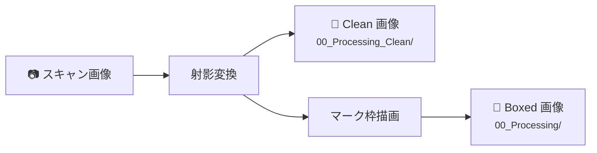
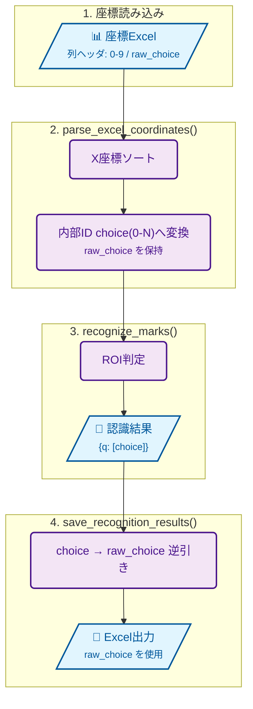

# 開発ガイド

採点侍 (SaitenSamurai) の開発に参加する方向けの技術情報です。

---

## 開発環境のセットアップ

```bash
git clone https://github.com/takehikoyasuda/SaitenSamurai-mac.git
cd SaitenSamurai-mac
pip install -r requirements.txt
```

### 型チェック

`pyrightconfig.json` で `main_src/` がインポートパスに設定されています。
Pylance / Pyright を使用する場合、追加設定は不要です。

```json
{
    "extraPaths": ["main_src"],
    "typeCheckingMode": "basic"
}
```

`basic` モードで型チェックを実施しています。error は 0 件を維持してください。
warning は段階的に解消中です。

### 起動確認

```bash
python main_src/saitensamurai.py
```

起動するとモード選択ダイアログが表示されます。
3 つの採点モード（マーク採点 / マーク＋記述 / 記述採点）から選択できます。

---

## リポジトリ構成

```
├── main_src/                    # アプリケーション本体（16 モジュール）
│   ├── saitensamurai.py         # エントリポイント
│   ├── constants.py             # 共通定数・ユーティリティ
│   ├── omr_engine.py            # OMR 認識エンジン
│   ├── threshold_calibrator.py  # 閾値自動推定
│   ├── scoring_engine.py        # 採点コアロジック
│   ├── image_renderer.py        # 採点結果の画像描画
│   ├── mark_checker.py          # エラー検出・修正補助
│   ├── descriptive_scorer.py    # 記述式採点コアロジック
│   ├── descriptive_gui.py       # 記述式採点 GUI
│   ├── descriptive_renderer.py  # 記述式採点描画
│   ├── name_trimmer.py          # 氏名トリミング
│   ├── summary_generator.py     # Excel サマリー生成
│   ├── ctt_analyzer.py          # CTT 分析
│   ├── r_export.py              # R 連携エクスポート
│   ├── gui_components.py        # サブウィンドウ GUI
│   └── main_gui.py              # メイン統合 GUI
├── tests/                       # pytest テスト（25 ファイル）
│   ├── conftest.py              # Tk ルート共有・パス設定
│   └── test_*.py
├── resources/                   # アプリリソース
│   ├── icon.ico
│   └── samurai.png
├── .github/workflows/test.yml   # GitHub Actions CI
├── saitensamurai.spec           # PyInstaller 設定
├── build_exe.bat                # exe ビルドスクリプト
├── requirements.txt             # 依存パッケージ定義
├── pyrightconfig.json           # 型チェック設定（basic モード）
├── LICENSE                      # GPL-3.0
└── THIRDPARTYLICENSES.md        # サードパーティライセンス
```

---

## モジュール依存関係

`constants.py` が全モジュールの基盤で、循環 import を防止しています。

```
constants.py              ← 他モジュールに依存しない基盤
scoring_engine.py         ← (pandas のみ、他モジュール非依存)
    ↑
omr_engine.py             ← constants
threshold_calibrator.py   ← constants, omr_engine
mark_checker.py           ← constants, omr_engine
name_trimmer.py           ← constants
r_export.py               ← constants            [lazy: ctt_analyzer]
ctt_analyzer.py           ← constants, scoring_engine
image_renderer.py         ← constants, scoring_engine, omr_engine
                                                   [lazy: descriptive_scorer]
descriptive_scorer.py     ← constants, name_trimmer
descriptive_gui.py        ← constants, descriptive_scorer, name_trimmer
descriptive_renderer.py   ← constants, descriptive_scorer
summary_generator.py      ← constants, scoring_engine
                                                   [lazy: ctt_analyzer, r_export]
gui_components.py         ← constants, mark_checker, threshold_calibrator
                                                   [lazy: scoring_engine, omr_engine]
main_gui.py               ← 全モジュール
                                                   [lazy: descriptive_gui, name_trimmer]
saitensamurai.py          ← main_gui（+ 後方互換 re-export）
```

!!! info "`[lazy: ...]` について"
    メソッド内で遅延 import されるモジュールを示します。
    循環 import の回避とオプショナル依存の制御に使用しています。

### 設計原則

- **constants.py** は他の `main_src/` モジュールを import してはならない
- **scoring_engine.py** は純粋ロジックのみ（ファイル I/O や画像処理に依存しない）
- **GUI 依存のない処理**は `*_engine.py` / `*_checker.py` 等に分離
- **遅延 import**: 循環回避やオプション機能の分離のため、多くのモジュールで `[lazy]` パターンを使用

---

## 画像パイプラインのアーキテクチャ

### 処理画像の生成 (`omr_engine.py`)

`process_box_drawer()` は各画像に対して以下の2種類の画像を生成します:

| フォルダ | 定数 | 内容 |
|---|---|---|
| `00_Processing/` | `BOXED_FOLDER` | マーク認識枠を描画した画像（マークチェック用） |
| `00_Processing_Clean/` | `CLEAN_FOLDER` | 射影変換のみ適用したクリーン画像（記述式採点プレビュー用） |



!!! warning "並列処理制約"
    `_process_single_image()` は `ProcessPoolExecutor` で並列実行されます。
    引数タプルのアンパック順序（8要素）を変更する場合、全ワーカーに影響するため注意してください。

??? info "args タプルの構成"
    ```python
    (image_path_str, boxed_folder_str, clean_folder_str,
    coordinates, question_groups, color_threshold, area_threshold, omr_mode)
    ```

### OMR 結果キャッシュ（v4.5.1）

`process_box_drawer()` は `01_Results/` 配下に以下のキャッシュを保存します。

| ファイル | 用途 |
|---|---|
| `marker_cache.json` | Step2 での射影変換高速化用キャッシュ |
| `whiteness_cache.json` | マークチェック画面の白さ順ソート高速化用キャッシュ |

`MarkCheckerGUI` 起動時は `whiteness_cache.json` を優先読み込みし、
見つからない場合のみ画像から白さを再計算します。

### K-means レポート集約時の注意（ラベル正規化）

K-means は画像単位で独立実行されるため、クラスタID（0/1）は画像ごとに入れ替わる可能性があります。
`generate_kmeans_report()` では集約時に「marked=1 / empty=0」へ正規化してから
ヒストグラム・PCA散布図を作成してください。

### マークチェック正答オーバーレイ (`gui_components.py`)

`MarkCheckerGUI` は正答枠（赤色点線）をプレビュー画像に描画します。

#### 座標変換パイプライン

```
mark_coords (ベース座標系: 595×842)
  → res_scale_x/y で実画像解像度にスケール
  → crop_from_corrected_image と同じクロップ座標変換
  → DEFAULT_SCALE_FACTOR で拡大
  → PIL ImageDraw で赤色点線矩形を描画
```

#### 問題番号のオフセット

| 用途 | 問題番号 | 説明 |
|---|---|---|
| テンプレート参照 | `question_no` | skip 後の採点用番号（1始まり） |
| coordinates.csv 参照 | `question_no + skip_questions` | 元の問題番号（skip 込み） |

### OMR 値変換パイプライン

座標 Excel の row0 の値ヘッダ (`raw_choice`) をそのまま表示値として使用します。
`parse_excel_coordinates()` が row0 のヘッダセルを読み取って `raw_choice` に格納します
（ヘッダ欠損時は出現順にフォールバック）。複数桁モード（ヘッダ -1〜13）では
`save_recognition_results()` が記号（-1→「-」、10〜13→a〜d）へ変換して出力します。



### 描画位置の設計

○×マークのデフォルト描画位置は `question_coords[num_choices - 2]`（後ろから 2 番目の選択肢）です。
`rendering_settings['mark_result_offset']` でセル幅単位のオフセット調整が可能です。

---

## 採点モードのアーキテクチャ

起動時にモード選択ダイアログ (`StartupModeDialog`) を表示し、
選ばれたモードに応じて `SaitenSamuraiGUI` の UI を切り替えます。

### モード定数（`constants.py`）

```python
MODE_MARK_ONLY = "mark_only"
MODE_MARK_AND_DESCRIPTIVE = "mark_and_descriptive"
MODE_DESCRIPTIVE_ONLY = "descriptive_only"
```

### 起動フロー（`saitensamurai.py`）

```
main() → StartupModeDialog(root) → mode, session_path を取得
       → SaitenSamuraiGUI(root, mode=mode, restore_session_path=session_path)
```

### モードごとの UI 差分

| UI 要素 | マーク採点 | マーク＋記述 | 記述採点 |
|---|:---:|:---:|:---:|
| 座標ファイル選択 | ○ | ○ | — |
| Skip 数設定 | ○ | ○ | — |
| OMR スライダー | ○ | ○ | — |
| 認識実行ボタン | ○ 認識実行 | ○ 認識実行 | ○ 画像準備 |
| 正答/OMR 結果選択 | ○ | ○ | — |
| 記述問題設定 | — | ○ | ○ |
| マークチェック | ○ | ○ | — |
| 記述採点ボタン | — | ○ | ○ |
| 記述採点の確認 | — | ○ | ○ |
| 描画詳細設定 (マーク) | ○ | ○ | — |
| 描画詳細設定 (記述) | — | ○ | ○ |

新しいモード固有 UI を追加する場合は `main_gui.py` 内で `self.app_mode` を参照して分岐してください。

### 記述採点のモード固定

記述採点は **問題一覧画面** でモードを選択してから開始します（`_scoring_mode_var`）。
前回選択したモードは `descriptive_config.json` に保存され、次回起動時に自動復元されます。
採点中はモード切替を表示せず、選択したモードで固定されます。
モードを変更したい場合は、採点を中断（自動保存）して問題一覧に戻り、再度選択してください。

---

## テスト

### テストの実行

```bash
# 標準的なテスト実行（推奨）
python -m pytest tests/ -q --timeout=60 -p no:warnings

# 特定のテストファイルのみ
python -m pytest tests/test_scoring_e2e.py -v --timeout=60

# カバレッジ付き
python -m pytest tests/ -q --timeout=60 -p no:warnings --cov=main_src --cov-report=term-missing
```

!!! info "2026-02 ローカル統合実行結果（参考）"
    `python -m pytest tests/ -q --timeout=60 -p no:warnings` 実行時、
    多くの環境で全体は通過しますが、Windows の Tcl/Tk 配布状態によっては
    `init.tcl` 不在に起因する `tkinter.TclError` が 1 件発生する場合があります。
    これはアプリ本体の業務ロジック不具合ではなく、実行環境依存の失敗です。

!!! warning "タイムアウト設定"
    `--timeout=60` を必ず付けてください。GUI テストがハングした場合にタイムアウトで失敗させます。  
    テスト実行には `pytest-timeout` が必要です（`pip install pytest-timeout`）。

### テスト共通設定 (`conftest.py`)

- `main_src/` をインポートパスに追加
- セッション全体で 1 つの Tk ルートウィンドウを共有
    - 各テストが `tk.Tk()` / `root.destroy()` を個別に行うと Tcl インタプリタが壊れるため
- `pytest_sessionfinish` で Tk ルートを安全に破棄

---

## Git 運用ガイド（初心者向け）

この章は、Git に不慣れな開発者が安全に運用できるようにするための最小ルールです。
アプリ本体の実装ルールとは独立しているため、引き継ぎ時の共通手順として利用できます。

### ブランチ方針

| ブランチ | 用途 | 誰が更新するか |
|---|---|---|
| `main` | アプリ本体・ドキュメント・ワークフロー定義 | 開発者 |
| `stats-data` | リリースDL集計 (`downloads.csv`) の機械生成履歴 | GitHub Actions |

`stats-data` を分離することで、`main` に日次の自動コミットが混ざらず、履歴ノイズと pull 競合を減らせます。

### 普段使う最小コマンド

```bash
# 1) 取り込み（merge commit を作らない）
git pull --rebase

# 2) 状態確認
git status -sb

# 3) 変更を記録
git add -A
git commit -m "feat: 変更内容"

# 4) 反映
git push
```

### 初回に入れておく推奨設定

```bash
git config --global pull.rebase true
git config --global rebase.autoStash true
git config --global pull.ff only
```

上記により、`git pull` 時の不要な merge commit を予防できます。

### 自動DL集計の流れ（main を汚さない）

1. Actions が GitHub API からダウンロード数を取得
2. `downloads.csv` を更新
3. 更新結果を `stats-data` ブランチへ push

`main` への自動書き込みは行いません。

### 公開してよい情報 / だめな情報

Git の運用手順そのものは個人情報ではないため、開発者向けドキュメントに記載して問題ありません。
ただし、以下は公開しないでください。

| 種別 | 例 |
|---|---|
| 秘密情報 | トークン、APIキー、パスワード |
| 個人情報 | 生徒名簿、個票データ、メールアドレス一覧 |
| 環境固有情報 | 個人PCの絶対パス、組織内サーバー名 |

### トラブル時の復旧（最小）

```bash
# 作業中変更を退避
git stash -u

# main を最新へ
git checkout main
git pull --rebase

# 退避を戻す
git stash pop
```

競合が出た場合は、慌てて push せず `git status` で競合ファイルを確認してから解決してください。

---

## コーディング規約

### 全般

- **エンコーディング**: UTF-8（BOM なし）
- **docstring**: モジュール先頭に概要と主な機能を記述
- **ログ出力**: Python 標準 `logging` モジュール経由。各モジュールで `logger = logging.getLogger(__name__)` を定義
- **パス操作**: `pathlib.Path` を推奨、`resource_path()` で PyInstaller 互換を確保

### 命名

| 対象 | 規則 | 例 |
|---|---|---|
| 関数名 | `snake_case` | `save_results()` |
| クラス名 | `PascalCase` | `StartupModeDialog` |
| 定数 | `UPPER_SNAKE_CASE` | `MODE_MARK_ONLY` |

定数は `constants.py` に集約してください。

### オプショナル依存

```python
try:
    import fitz
    HAS_PYMUPDF = True
except ImportError:
    fitz = None
    HAS_PYMUPDF = False
```

PyMuPDF, matplotlib, reportlab はオプション扱いです。
未インストール時はフラグで分岐し、該当機能を無効化してください。

---

## コミット禁止物

以下はリポジトリにコミットしないでください（`.gitignore` で除外済み）:

| パターン | 理由 |
|---|---|
| `_saiten_grading_results/` | アプリが生成する採点結果 |
| `_mark2_grading_results/` | 旧フォルダ名（後方互換） |
| `template_coordinates.csv` | 座標パース時のデバッグ CSV |
| `tmp_checking_dm_nm.csv` | Checker 一時ファイル |
| `sample_bigfiles/` | 大容量テストデータ |
| `venv_build/` | exe ビルド用仮想環境 |
| `dist/` | ビルド出力 |
| `build/` | PyInstaller 中間出力 |
| `*.log` | クラッシュログ等 |
| `tests/tmp_output/` | テスト一時出力 |
| `.vscode/` | エディタ設定 |

---

## exe ビルド（Windows 向け）

!!! info "macOS 向けパッケージについて"
    以下は Windows 版 exe のビルド手順です。macOS 向けの単体アプリ配布は現状未対応で、`python main_src/saitensamurai.py` でのソース実行のみとなります。

### ビルド手順

```bash
build_exe.bat
```

出力: `dist/SaitenSamurai.exe`

### 仕組み

1. `venv_build/` にビルド専用仮想環境を作成
2. `requirements.txt` + `pyinstaller` をインストール
3. `saitensamurai.spec` に従って PyInstaller でビルド

### spec ファイルの構成 (`saitensamurai.spec`)

- **エントリポイント**: `main_src/saitensamurai.py`
- **同梱データ**: `resources/icon.ico`, `resources/samurai.png`
- **hiddenimports**: `main_src` の全モジュール + オプション依存
- **excludes**: 不要なバックエンド (GTK/Qt/Wx)、テスト、開発ツール等
- **バイナリ除外**: AVIF/WebP プラグイン DLL、FFmpeg DLL
- **データ除外**: haarcascade XML、matplotlib サンプルデータ

### 軽量化のポイント

- `opencv-python-headless` を使用（highgui/FFmpeg 不要）
- matplotlib は `backend_agg` と `backend_tkagg` のみ残す
- matplotlib フォントは DejaVuSans のみ残し、AFM・STIX・CM 等を除外
- Pillow の未使用フォーマットプラグインを除外
- 不要な標準ライブラリ (`sqlite3`, `xmlrpc`, `ftplib` 等) を除外
- ネットワーク系パッケージ (`certifi`, `urllib3`, `requests`) を除外
